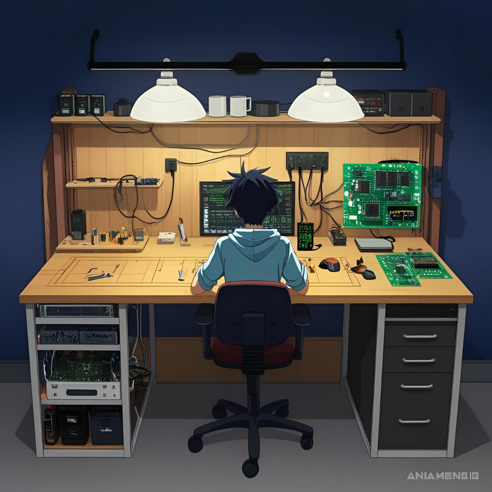

# 101 Electronics
Kurs elektroniki odbywający się w Hackerspace Trójmiasto.

Ideą projektu jest popularyzacja sztuki elektroniki poprzez spotakania z trenerem i rozwiązywania problemów w grupie.

Na początek zaczniemy od łatwych projektów celem wyposażenia warsztatu elektronika.

# Propozycje projektów
Na początek warto wyposażyć się w narzędzia do produkcji PCB aby prototypować bez czekania na przesyłkę z Chin.
## Warsztat elektornika
* Wobuloscop
* Automatyczna naświetlarka do fotorezystu
* Ploter PCB
* Huśtawka do wytrawiania
* Miernik indukcyjności
* Generator sygnałowy
## Projekty
* Lewitron
* Mikrofon referencyjny
* Wzmacniacz lampowy
* UPS dla mikrokontrolera
* Fake perpetum mobile
  
przynieś własne pomysły! 

# Spotkania
Widzimy się w każdą środę w hs3 o 20:00.
Zaczynamy 26.03.2025 roku.

